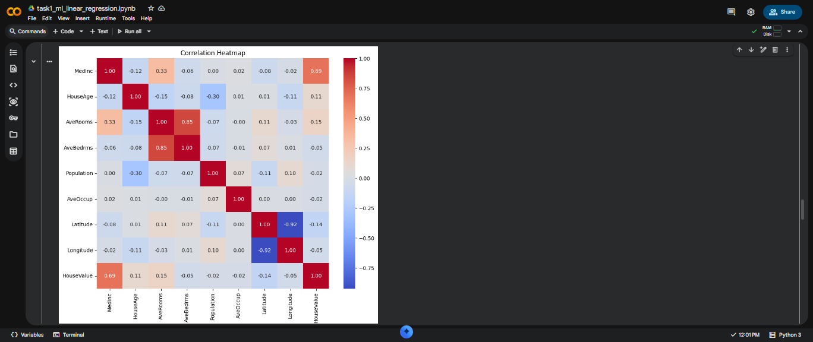
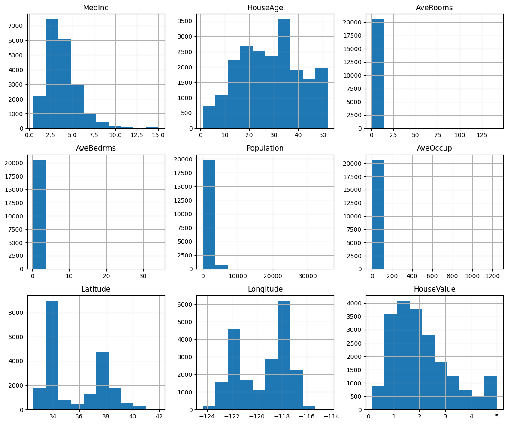
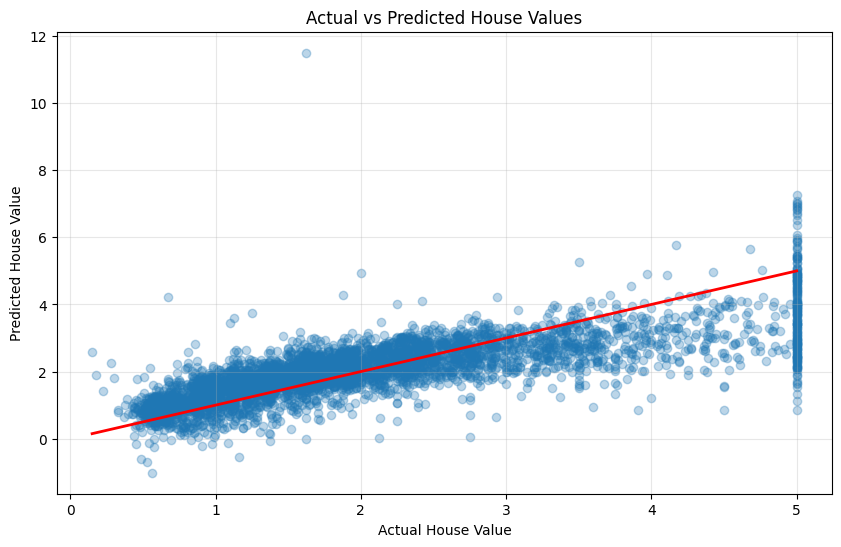
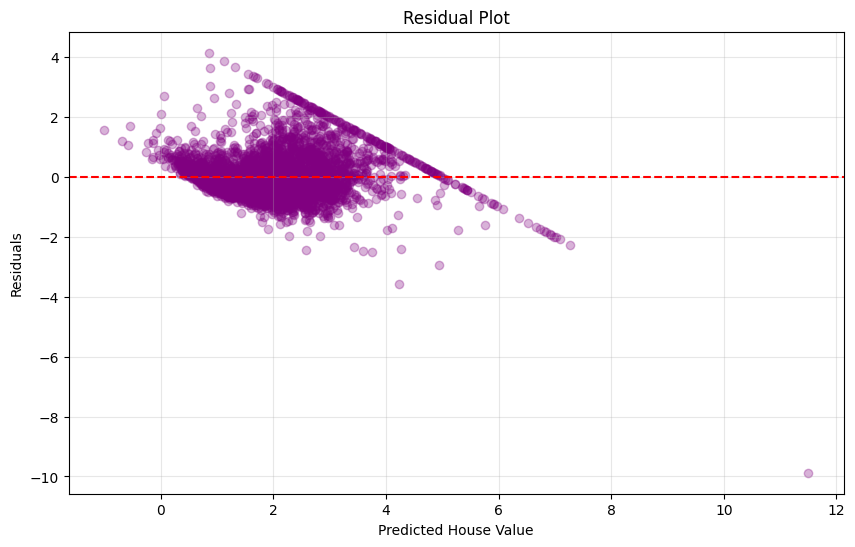
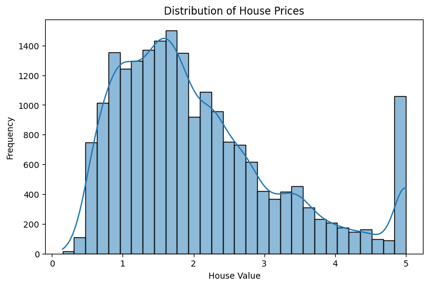

# California Housing Price Prediction using Linear Regression

##  Project Overview

This project implements a **Linear Regression** model to predict California house prices using the California Housing dataset from Scikit-learn.

The project covers the complete machine learning workflow:
- Data Loading
- Exploratory Data Analysis (EDA)
- Data Preprocessing
- Feature Selection
- Train-Test Split
- Model Training
- Prediction
- Model Evaluation
- Model Saving using Pickle

---

##  Project Structure

```
.
├── task1_ml_linear_regression.ipynb
├── house_price_model.pkl
└── README.md
```

---

##  Dataset

The project uses the **California Housing Dataset** available in the `sklearn.datasets` module.

### Features

- MedInc
- HouseAge
- AveRooms
- AveBedrms
- Population
- AveOccup
- Latitude
- Longitude

### Target

- HouseValue

---

##  Technologies Used

- Python
- Google Colab
- Pandas
- NumPy
- Matplotlib
- Seaborn
- Scikit-learn
- Pickle

---

##  Exploratory Data Analysis

The following analyses were performed:

- Dataset inspection
- Missing value analysis
- Histograms
- Correlation matrix
- Correlation heatmap

---

##  Machine Learning Model

**Algorithm Used**

- Linear Regression

### Data Split

- Training Data: 80%
- Testing Data: 20%

Random State:

```python
random_state = 42
```

---

##  Model Performance

| Metric   | Score  |
|----------|--------|
| MAE      | 0.5332 |
| RMSE     | 0.7456 |
| R² Score | 0.5758 |

---

##  Model Saving

The trained model is saved using Python's Pickle module.

```python
import pickle

with open("house_price_model.pkl", "wb") as file:
    pickle.dump(model, file)
```

---

##  How to Run

1. Clone the repository.

```bash
git clone <repository-url>
```

2. Open the notebook in Google Colab or Jupyter Notebook.

3. Run all cells sequentially.

4. The trained model will be saved as:

```
house_price_model.pkl
```

---

##  Results

The Linear Regression model achieved an **R² score of 0.5758**, indicating that it explains approximately **57.6% of the variance** in California house prices. While it serves as a good baseline model, more advanced algorithms could further improve prediction accuracy.

---

## Learning Outcomes

Through this project, I learned:

- Data preprocessing
- Exploratory Data Analysis (EDA)
- Correlation analysis
- Feature selection
- Train-test splitting
- Linear Regression
- Model evaluation using MAE, RMSE and R²
- Saving trained models using Pickle

---

##  Author

**Asma**

Machine Learning Internship Task 1

## Correlation Heatmap



## Distribution of Features



## Actual Vs Prediction Plot



## Residual Plot



## House Price Distribution

